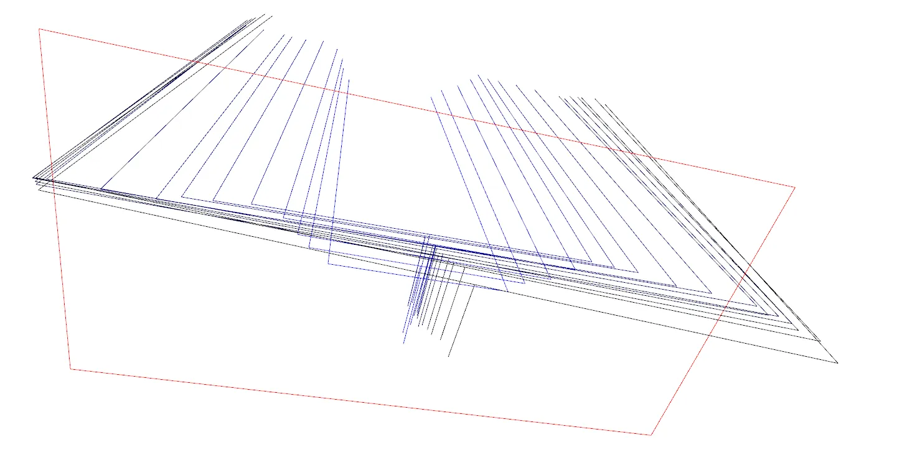

# umi-helper

### generate_dataset_from_card.py
从数据存储卡中将数据自动导到 `data/dataset/`, mapping数据必须大于50s， 其他数据必须小于50s， 30s~50s之间的数据提示进行检查，小于2s的数据自动滤除，第一条小于50s的数据默认为calibration数据， 每一条mapping数据都会生成一个文件夹，一个文件夹是一个数据集。

``` bash
# usage
TASK=your_task_name
python generate_dataset_from_card.py --task $TASK
```

### vis_real_result.py
实际部署代码会在 `data/experiment/action` 文件夹下面生成图片和对应的action输出。这个脚本使用open3d对图片和action进行可视化。
``` bash
# usage
python vis_real_result.py --video /home/user/universal_manipulation_interface/data/experiments/wahaha/action/223
```


整个夹爪的形状的可视化，往夹爪前方为z轴，朝地面为y轴，拿住夹爪左侧为x轴。y轴用短竖线表示。一共可视化16步网络输出，从有颜色到黑色为时间推移的action输出。蓝色为网络预测结果。红色框表明夹爪初始位置。这幅图表明夹爪将逐渐张开（是一个错误的结果）。
### vis_training_result.py
可视化ckpt在训练集上面的拟合效果。
``` bash
# usage
python vis_training_result.py \
-i /home/user/universal_manipulation_interface/data/outputs/merged_cup/epoch=0000-train_loss=0.035.ckpt \
--replay_buffer /home/user/universal_manipulation_interface/data/dataset/cup_in_the_wild/dataset.zarr.zip \
--output tmp/
```


整个夹爪的形状的可视化，往夹爪前方为z轴，朝地面为y轴，拿住夹爪左侧为x轴。y轴用短竖线表示。一共可视化16步网络输出，从有颜色到黑色为时间推移的action输出。绿色为真值，蓝色为网络预测结果。红色框表明夹爪初始位置。这幅图表示夹爪学到了往后退的同时往视野右边移动的结果。
### merge_dataset_plan_to_replay_buffer.py
数据集有两种格式，一种是最终的zarr.zip格式，一种是dataset_plan.pkl，前者是压缩了的，后者是不压缩的。
这个脚本将新采集的pkl格式数据添加到已有的zarr.zip格式的数据中。
``` bash
# usage
cd path/to/scripts/
TATASETBASE=data/dataset/fold_pink_towel_hjc_best
NEWDATA=data/dataset/fold_pink_towel_lyl_right_v3
OUTPUT=data/dataset/fold_pink_towel_merged_dataset_v1
python merge_dataset_plan_to_replay_buffer.py -i $NEWDATA -e $TATASETBASE -o $OUTPUT
```

### visualize_dataset.py
可视化训练数据，确保训练数据zarr.zip正确。
``` bash
# usage
cd path/to/scripts/
DATASET=data/dataset/fold_pink_towel_lyl_right_v3
python visualize_dataset.py --dataset $DATASET
```

这是一个夹毛巾的轨迹，从起点开始到毛巾的右下角（红色表示夹爪张开），然后夹爪闭合（轨迹变成蓝色），操作毛巾的右下角到左上角，然后夹爪张开。夹爪来到毛巾左下角，操作该点到右上角。夹爪张开，回到毛巾上方。